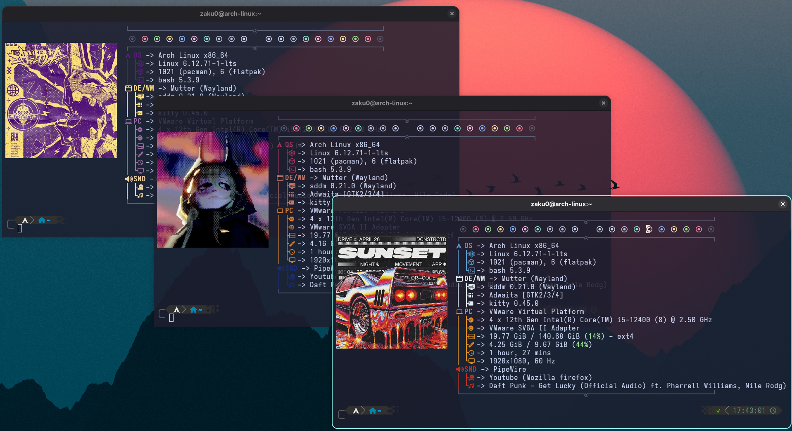

# Mi Configuración de Fastfetch 🚀
Este repositorio contiene mi configuración personalizada de **Fastfetch**.

## Pre-requisitos
Antes de instalar, asegúrate de tener lo siguiente:
* **Fastfetch** 🚀
* **Kitty** 🐱
* **Nerd Fonts** 👓

## ¿Qué hace el instalador?
1. Crea los directorios `~/.config/fastfetch` y `~/.local/bin` si en caso no existan.
2. Mueve la carpeta de `logos` y el archivo `config.jsonc` a `~/.config/fastfetch` .
3. Mueve el script `ff-random.sh` a `~/.local/bin` 
4. Da permisos de ejecución a `ff-random.sh`.
5. Crea el alias `fastzk` en tu `.bashrc` o `.zshrc` automáticamente.

## Qué incluye:
* **Fastzk**: Un alias que se usará para ejecutar un fastfetch con logos y colores dinamicos en forma ciclica.
* **Configuración fastfetch**: Configuración personalizada que tomo como base a examples/10.jsonc del repo oficial de fastfetch.
* **Logos y colores**: Logos .png y un archivo de colores Hexadecimal que se ubican en `~/.config/fastfetch/logo`.
* **Script**: El script `ff-random.sh` que se encargará de cambiar de imagen y color a los campos del fastfetch.

## Como Modificar:
❗Primero considerar que debe haber la misma cantidad de opciones de colores en `colores.conf` y la misma cantidad de imagenes con formato .png en el directorio `logos` para que el script `ff-random.sh` funcione correctamente.
Por si quieren quitar o agregar imagenes de la configuración también deben de tener en cuenta a `colores.conf`. La mayoría de limitaciones que hay en la modificación en mí configuración de fastfetch es debido al script `ff-random.sh`, si desean implementar cambios e ignorar las limitación deben de readaptar el script `ff-random.sh`.

* **Modificar Logos**: Los logos serán imagenes en formato .png y obligatoriamente deben tener en su nombres como primer caracter un número, ejemplo: 1.png, 2.png o 71.png, y de preferencia deben ser nombres en secuencia como "0.png, 1.png, 2.png, 3.png ... #.png". Ubicación : `~/.config/fastfetch/logos/*.png`.
  
* **Modificar Colores**: Los colores están en formato Hexadecimal y cada color le corresponde al nombre de una imagen, en fastfetch hay 4 grupos de módulos diferenciados por el color que se determinan por su **KeyColor** y **C1, C2, C3, C4**, si desean agregar un nuevo modulo como "date time, version, font, etc" deben asignarle a su "Keycolor" un valor como "C1, C2, C3 o C4". Ubicación : `~/.config/fastfetch/logos/colores.conf`.
  
* **Modificar fastfetch**: El único archivo que deben tocar para modificar aspectos, módulos y campos del fastfetch es -> **config.jsonc**, NO X**config_run.jsonc** , preferiblemente no tocar los campos de **source y type** para evitar errores en la carga aleatoria. Para agregar nuevos módulos como "date time, version, font, etc" y se siga mantiendo la sincronia de los colores se deben de crear junto con la variable "Keycolor" y darle algunos de estos valores "C1, C2, C3 o C4". Ubicación: `~/.config/fastfetch/`.
